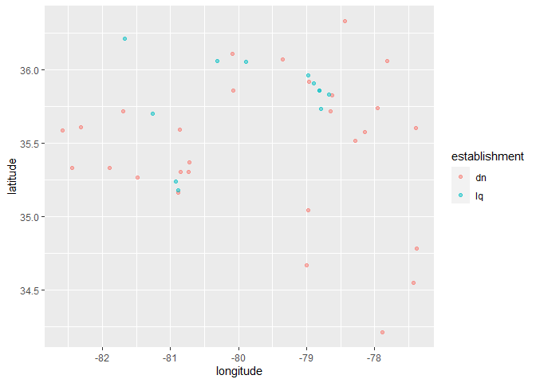

Lab 04 - La Quinta is Spanish for next to Denny’s, Pt. 1
================
Insert your name here
Insert date here

### Load packages and data

``` r
library(tidyverse) 
library(dsbox)
```

``` r
states <- read_csv("data/states.csv")
```

### Exercise 1,2

``` r
 dennys <- dennys
 laquinta <- laquinta 

dim(dennys)
```

    ## [1] 1643    6

``` r
dim(laquinta)
```

    ## [1] 909   6

``` r
# View(dennys)
# View(laquinta)

str(dennys)
```

    ## spec_tbl_df [1,643 x 6] (S3: spec_tbl_df/tbl_df/tbl/data.frame)
    ##  $ address  : chr [1:1643] "2900 Denali" "3850 Debarr Road" "1929 Airport Way" "230 Connector Dr" ...
    ##  $ city     : chr [1:1643] "Anchorage" "Anchorage" "Fairbanks" "Auburn" ...
    ##  $ state    : chr [1:1643] "AK" "AK" "AK" "AL" ...
    ##  $ zip      : chr [1:1643] "99503" "99508" "99701" "36849" ...
    ##  $ longitude: num [1:1643] -149.9 -149.8 -147.8 -85.5 -86.8 ...
    ##  $ latitude : num [1:1643] 61.2 61.2 64.8 32.6 33.6 ...
    ##  - attr(*, "spec")=
    ##   .. cols(
    ##   ..   address = col_character(),
    ##   ..   city = col_character(),
    ##   ..   state = col_character(),
    ##   ..   zip = col_character(),
    ##   ..   longitude = col_double(),
    ##   ..   latitude = col_double()
    ##   .. )

``` r
str(laquinta)
```

    ## spec_tbl_df [909 x 6] (S3: spec_tbl_df/tbl_df/tbl/data.frame)
    ##  $ address  : chr [1:909] "793 W. Bel Air Avenue" "3018 CatClaw Dr" "3501 West Lake Rd" "184 North Point Way" ...
    ##  $ city     : chr [1:909] "\nAberdeen" "\nAbilene" "\nAbilene" "\nAcworth" ...
    ##  $ state    : chr [1:909] "MD" "TX" "TX" "GA" ...
    ##  $ zip      : chr [1:909] "21001" "79606" "79601" "30102" ...
    ##  $ longitude: num [1:909] -76.2 -99.8 -99.7 -84.7 -96.6 ...
    ##  $ latitude : num [1:909] 39.5 32.4 32.5 34.1 34.8 ...
    ##  - attr(*, "spec")=
    ##   .. cols(
    ##   ..   address = col_character(),
    ##   ..   city = col_character(),
    ##   ..   state = col_character(),
    ##   ..   zip = col_character(),
    ##   ..   longitude = col_double(),
    ##   ..   latitude = col_double()
    ##   .. )

``` r
glimpse(dennys)
```

    ## Rows: 1,643
    ## Columns: 6
    ## $ address   <chr> "2900 Denali", "3850 Debarr Road", "1929 Airport Way", "230 ~
    ## $ city      <chr> "Anchorage", "Anchorage", "Fairbanks", "Auburn", "Birmingham~
    ## $ state     <chr> "AK", "AK", "AK", "AL", "AL", "AL", "AL", "AL", "AL", "AL", ~
    ## $ zip       <chr> "99503", "99508", "99701", "36849", "35207", "35294", "35056~
    ## $ longitude <dbl> -149.8767, -149.8090, -147.7600, -85.4681, -86.8317, -86.803~
    ## $ latitude  <dbl> 61.1953, 61.2097, 64.8366, 32.6033, 33.5615, 33.5007, 34.206~

``` r
glimpse(laquinta)
```

    ## Rows: 909
    ## Columns: 6
    ## $ address   <chr> "793 W. Bel Air Avenue", "3018 CatClaw Dr", "3501 West Lake ~
    ## $ city      <chr> "\nAberdeen", "\nAbilene", "\nAbilene", "\nAcworth", "\nAda"~
    ## $ state     <chr> "MD", "TX", "TX", "GA", "OK", "TX", "AG", "TX", "NM", "NM", ~
    ## $ zip       <chr> "21001", "79606", "79601", "30102", "74820", "75254", "20345~
    ## $ longitude <dbl> -76.18846, -99.77877, -99.72269, -84.65609, -96.63652, -96.8~
    ## $ latitude  <dbl> 39.52322, 32.41349, 32.49136, 34.08204, 34.78180, 32.95164, ~

``` r
table(laquinta$state)
```

    ## 
    ##  AG  AK  AL ANT  AR  AZ  BC  CA  CH  CO  CT  FL  FM  GA  IA  ID  IL  IN  KS  KY 
    ##   1   2  16   1  13  18   1  56   1  27   6  74   1  41   4  10  17  17   9  10 
    ##  LA  MA  MD  ME  MI  MN  MO  MS  MT  NC  ND  NE  NH  NJ  NL  NM  NV  NY  OH  OK 
    ##  28   6  13   1   4   7  12  12   9  12   5   5   2   5   3  19   8  19  17  29 
    ##  ON  OR  PA  PU  QR  RI  SC  SD  SL  TN  TX  UT  VA  VE  VT  WA  WI  WV  WY 
    ##   1  10  10   2   1   2   8   2   1  30 237  12  14   1   2  16  13   3   3

### Exercise 3

denny - no laQuinta -yes …

### Exercise 4

state, address, latitude, etc.

…

### Exercise 5

``` r
dennys%>%
  filter(!(state %in% states$abbreviation))%>%
  print()
```

    ## # A tibble: 0 x 6
    ## # ... with 6 variables: address <chr>, city <chr>, state <chr>, zip <chr>,
    ## #   longitude <dbl>, latitude <dbl>

…

### Exercise 6

``` r
dennys <- dennys %>%
  dplyr::mutate(country ="United States")
```

…

### Exercise 7

``` r
laquinta %>%
  filter(!(state %in% states$abbreviation)) %>%
  print() 
```

    ## # A tibble: 14 x 6
    ##    address                                  city  state zip   longitude latitude
    ##    <chr>                                    <chr> <chr> <chr>     <dbl>    <dbl>
    ##  1 Carretera Panamericana Sur KM 12         "\nA~ AG    20345    -102.     21.8 
    ##  2 Av. Tulum Mza. 14 S.M. 4 Lote 2          "\nC~ QR    77500     -86.8    21.2 
    ##  3 Ejercito Nacional 8211                   "Col~ CH    32528    -106.     31.7 
    ##  4 Blvd. Aeropuerto 4001                    "Par~ NL    66600    -100.     25.8 
    ##  5 Carrera 38 # 26-13 Avenida las Palmas c~ "\nM~ ANT   0500~     -75.6     6.22
    ##  6 AV. PINO SUAREZ No. 1001                 "Col~ NL    64000    -100.     25.7 
    ##  7 Av. Fidel Velazquez #3000 Col. Central   "\nM~ NL    64190    -100.     25.7 
    ##  8 63 King Street East                      "\nO~ ON    L1H1~     -78.9    43.9 
    ##  9 Calle Las Torres-1 Colonia Reforma       "\nP~ VE    93210     -97.4    20.6 
    ## 10 Blvd. Audi N. 3 Ciudad Modelo            "\nS~ PU    75010     -97.8    19.2 
    ## 11 Ave. Zeta del Cochero No 407             "Col~ PU    72810     -98.2    19.0 
    ## 12 Av. Benito Juarez 1230 B (Carretera 57)~ "\nS~ SL    78399    -101.     22.1 
    ## 13 Blvd. Fuerza Armadas                     "con~ FM    11101     -87.2    14.1 
    ## 14 8640 Alexandra Rd                        "\nR~ BC    V6X1~    -123.     49.2

## Exercise8

``` r
laquinta<-laquinta %>%
  mutate(country = case_when(
    state %in% state.abb     ~ "United States",
    state %in% c("ON", "BC") ~ "Canada",
    state == "ANT"           ~ "Colombia",
    state == "FM"            ~ "Hondoras",
    state == "AG"           ~  "Mexico"))  

laquinta<-laquinta%>%
  filter(country=="United States")
```

## Exercise 9

``` r
sort(table(dennys$state))
```

    ## 
    ##  DE  DC  VT  AK  IA  NH  SD  WV  LA  MT  ND  WY  MS  NE  RI  HI  AL  ME  TN  KS 
    ##   1   2   2   3   3   3   3   3   4   4   4   4   5   5   5   6   7   7   7   8 
    ##  MA  AR  NJ  ID  CT  MN  OK  KY  SC  GA  MI  OR  WI  MD  UT  NC  NM  VA  CO  NV 
    ##   8   9  10  11  12  15  15  16  17  22  22  24  25  26  27  28  28  28  29  35 
    ##  IN  PA  MO  OH  WA  IL  NY  AZ  FL  TX  CA 
    ##  37  40  42  44  49  56  56  83 140 200 403

``` r
sort(table(laquinta$state))
```

    ## 
    ##  ME  AK  NH  RI  SD  VT  WV  WY  IA  MI  ND  NE  NJ  CT  MA  MN  NV  SC  KS  MT 
    ##   1   2   2   2   2   2   3   3   4   4   5   5   5   6   6   7   8   8   9   9 
    ##  ID  KY  OR  PA  MO  MS  NC  UT  AR  MD  WI  VA  AL  WA  IL  IN  OH  AZ  NM  NY 
    ##  10  10  10  10  12  12  12  12  13  13  13  14  16  16  17  17  17  18  19  19 
    ##  CO  LA  OK  TN  GA  CA  FL  TX 
    ##  27  28  29  30  41  56  74 237

DE ME Actually, I am not familiar with that states..

## Exercise10

``` r
dennys %>%
  count(state) %>%
  inner_join(states,by=c("state" = "abbreviation"
  )) %>%
 dplyr::mutate(den_per_sq = 1000*area/n) %>%
  arrange(den_per_sq)
```

    ## # A tibble: 51 x 5
    ##    state     n name                     area den_per_sq
    ##    <chr> <int> <chr>                   <dbl>      <dbl>
    ##  1 DC        2 District of Columbia     68.3     34170 
    ##  2 RI        5 Rhode Island           1545.     308978 
    ##  3 CA      403 California           163695.     406190.
    ##  4 CT       12 Connecticut            5543.     461951.
    ##  5 FL      140 Florida               65758.     469698.
    ##  6 MD       26 Maryland              12406.     477151.
    ##  7 NJ       10 New Jersey             8723.     872258 
    ##  8 NY       56 New York              54555.     974196.
    ##  9 IN       37 Indiana               36420.     984312.
    ## 10 OH       44 Ohio                  44826.    1018763.
    ## # ... with 41 more rows

``` r
laquinta %>%
  count(state)%>%
  inner_join(states,by=c("state"="abbreviation"
  )) %>%
 dplyr::mutate(den_per_sq = 1000*area/n) %>%
  arrange(den_per_sq)
```

    ## # A tibble: 48 x 5
    ##    state     n name             area den_per_sq
    ##    <chr> <int> <chr>           <dbl>      <dbl>
    ##  1 RI        2 Rhode Island    1545.    772445 
    ##  2 FL       74 Florida        65758.    888618.
    ##  3 CT        6 Connecticut     5543.    923902.
    ##  4 MD       13 Maryland       12406.    954302.
    ##  5 TX      237 Texas         268596.   1133318.
    ##  6 TN       30 Tennessee      42144.   1404808.
    ##  7 GA       41 Georgia        59425.   1449394.
    ##  8 NJ        5 New Jersey      8723.   1744516 
    ##  9 MA        6 Massachusetts  10554.   1759065 
    ## 10 LA       28 Louisiana      52378.   1870648.
    ## # ... with 38 more rows

``` r
dennys <- dennys %>%
  mutate(establishment="dn")

laquinta <- laquinta%>%
  mutate(establishment = "lq")

dn_lq<-bind_rows(dennys,laquinta)

ggplot(dn_lq, mapping = aes(x = longitude, y = latitude, color = establishment)) +
  geom_point()
```

<!-- -->

## Exercise 11

``` r
dn_lqNC <- dn_lq %>%
  filter(state == "NC")

ggplot(dn_lqNC, mapping = aes(x = longitude, y = latitude, color = establishment)) +
  geom_point(alpha=0.5)
```

<!-- -->

## Exercise 12

``` r
dn_lqTX<- dn_lq %>%
  filter(state == "TX")


ggplot(dn_lqTX, mapping = aes(x = longitude, y = latitude, color = establishment)) +
  geom_point(alpha=0.5)
```

<!-- -->
